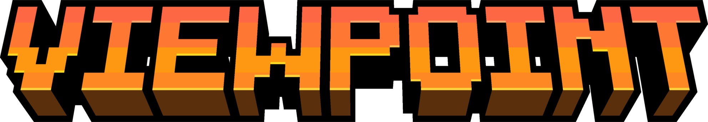

[Download from Modrinth](https://modrinth.com/mod/viewpoint)

## About
Viewpoint is a minimal version of [Perspective](https://modrinth.com/mod/mclegoman-perspective) with only the zoom and hold perspective features.

## Dependencies
- [Fabric API](https://modrinth.com/mod/fabric-api) or [Quilted Fabric API (QFAPI)](https://modrinth.com/mod/qsl)

This version of Viewpoint is a direct port of [Perspective 1.2.0-alpha.2 for 1.20.1](https://github.com/mclegoman/perspective/releases/tag/1.2.0-alpha.2-1.20.0-1), with zoom being set to Logarithmic and scaled.
Options for logarithmic/scaled aren't in this build.

#
Licensed under LGPL-3.0-or-later.

**This mod is not affiliated with/endorsed by Mojang Studios or Microsoft.**  
Some game assets are property of Mojang Studios and fall under Minecraft EULA.  
